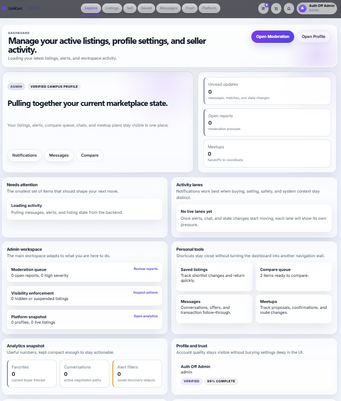
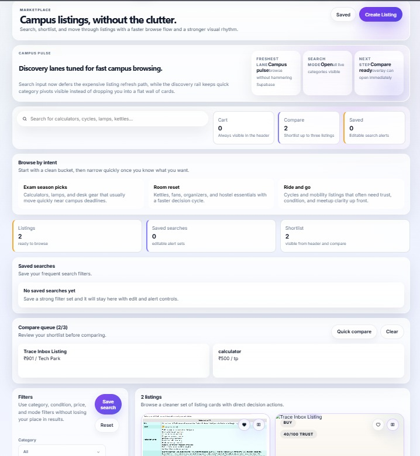
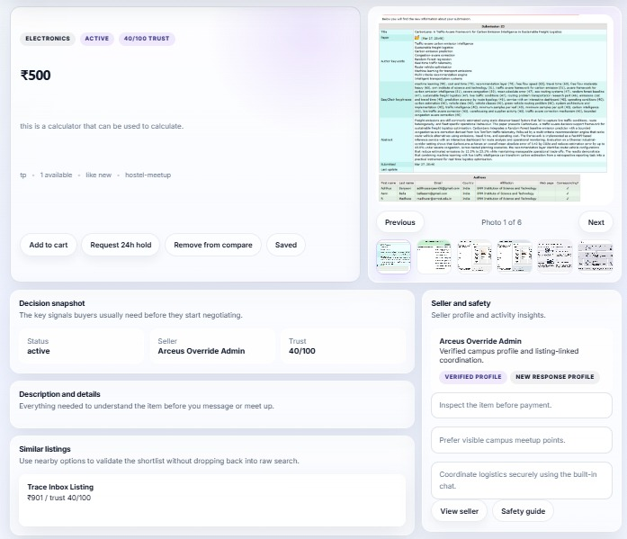
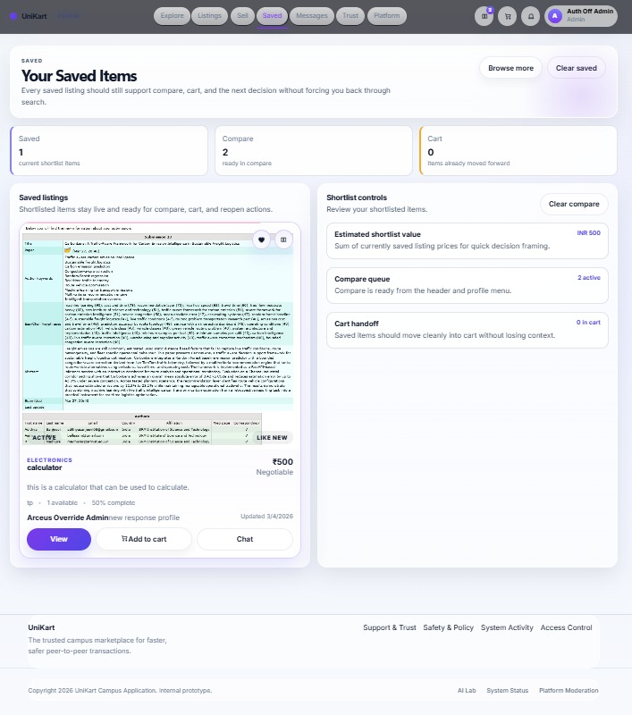
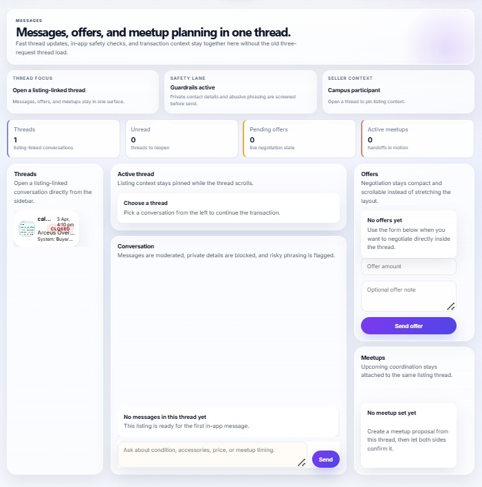
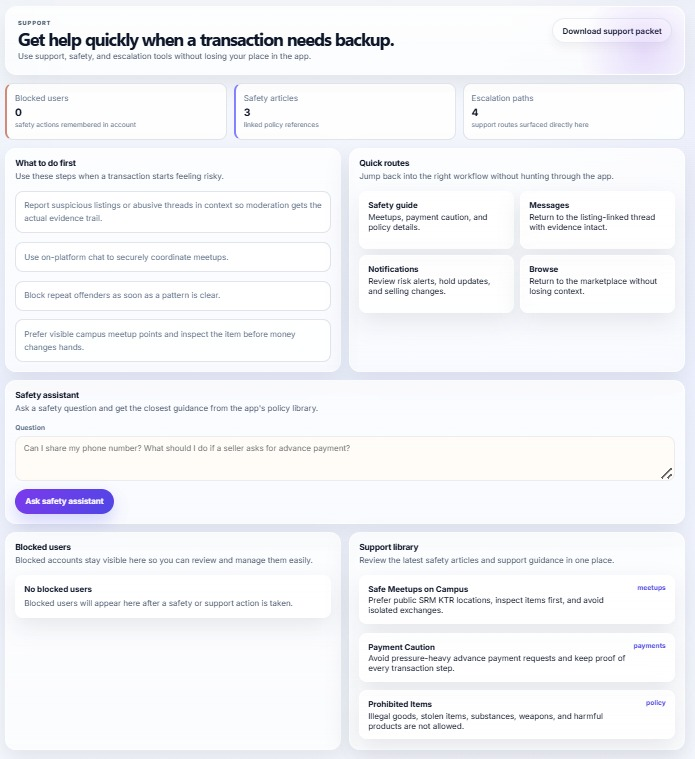
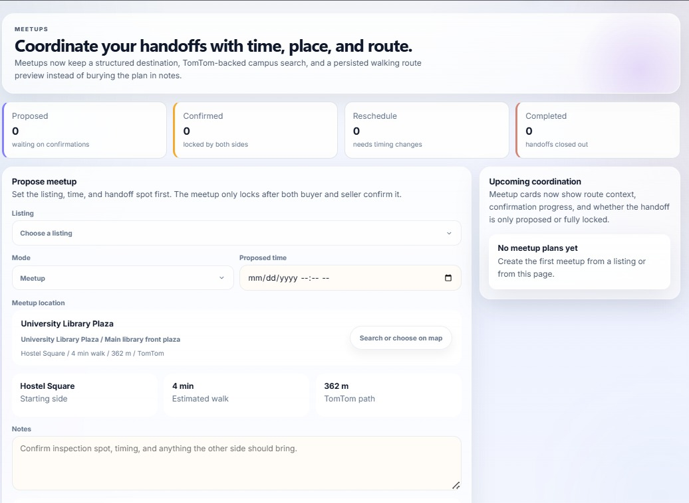
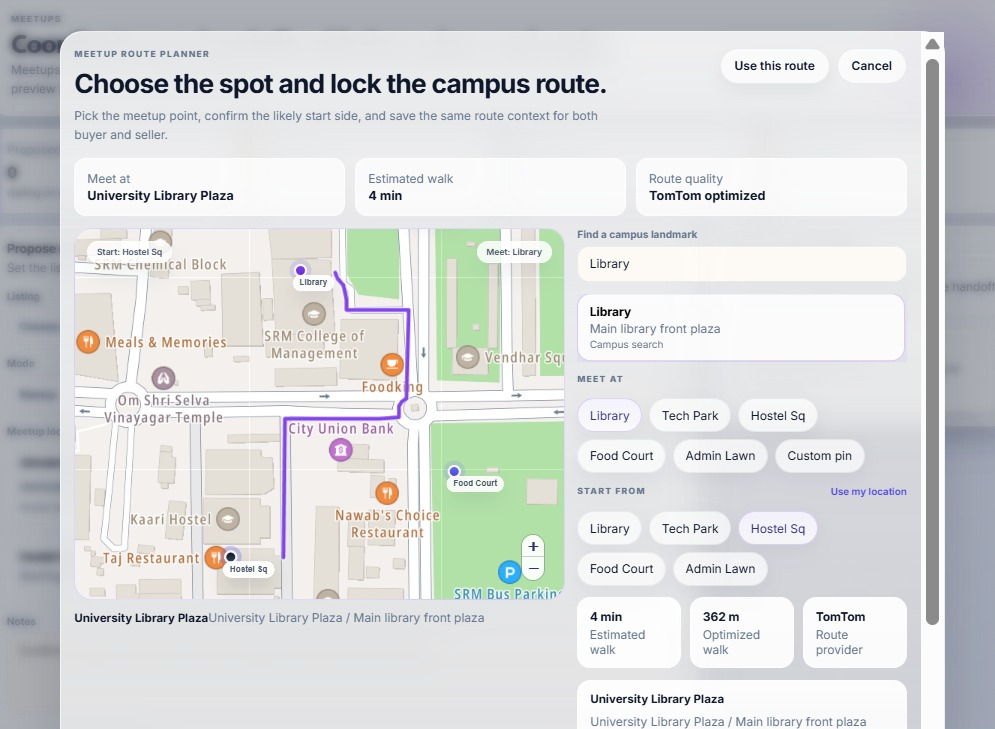
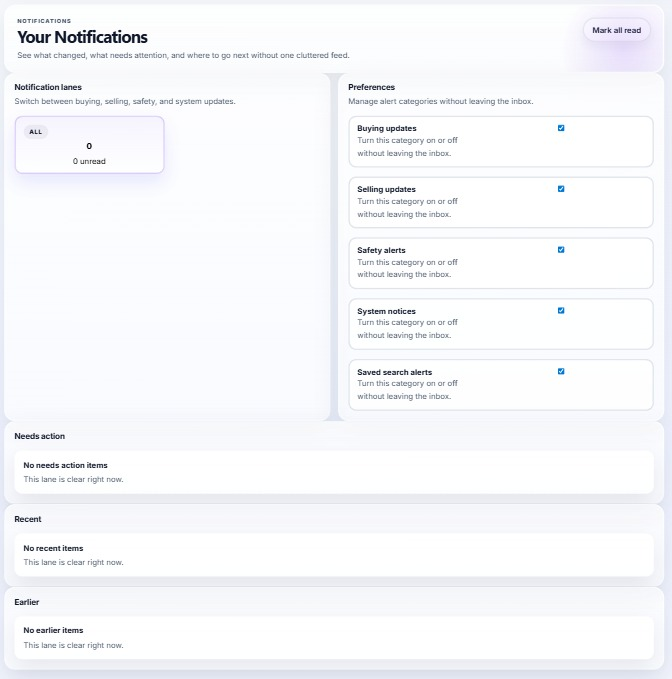

# CampusMarket

<p align="center">
  <strong>CampusMarket</strong> is the GitHub repository for <strong>UniKart</strong>, a campus-first commerce platform built for SRM KTR students to buy, sell, rent, compare, message, negotiate, schedule meetups, and transact with more structure than informal resale groups.
</p>

<p align="center">
  
  
  
  
  
  
  
</p>

> `CampusMarket` is the repo name. `UniKart` is the product name used across the codebase and UI.

## Portfolio Summary

UniKart is not just a listing board. It is a full-stack campus marketplace system with role-aware dashboards, listing composition, in-app messaging, offer and hold flows, meetup scheduling, campus route planning, AI-assisted listing quality and moderation, notification lanes, admin tooling, PDF exports, and a database layer hardened with Supabase migrations, indexes, and row-level security.

If the goal is to present this as a major engineering project, the strongest angle is this: the repo shows product thinking, front-end system design, API design, data modeling, operational tooling, safety-aware UX, and third-party service integration in one coherent system.

## Project Snapshot

- Built as a campus-first resale platform for SRM KTR students
- Covers buyer, seller, and admin/operator workflows
- Includes `18` frontend page routes, `14` backend route groups, and `17` Supabase migrations
- Implements listing creation, compare queues, favorites, saved filters, notification inboxes, messaging, offers, holds, meetups, moderation, analytics, and exports
- Uses graceful fallback behavior for AI and campus routing when provider credentials are unavailable
- Structured as a real multi-surface product, not a single-demo page or isolated CRUD assignment

## Application Preview

Screens below are captured from the actual application UI.

<table>
  <tr>
    <td align="center" width="33%">
      
      <br />
      <strong>Dashboard</strong>
      <br />
      Buyer, seller, and admin workspaces collapse current state into one role-aware overview.
    </td>
    <td align="center" width="33%">
      
      <br />
      <strong>Marketplace</strong>
      <br />
      Discovery includes saved searches, compare queues, intent browsing, and listing-first decision support.
    </td>
    <td align="center" width="33%">
      
      <br />
      <strong>Listing Detail</strong>
      <br />
      Detailed listing context includes trust signals, seller profile cues, and action-oriented transaction controls.
    </td>
  </tr>
  <tr>
    <td align="center" width="33%">
      
      <br />
      <strong>Saved Items</strong>
      <br />
      Shortlisted listings stay connected to compare, cart, and follow-up actions instead of becoming dead bookmarks.
    </td>
    <td align="center" width="33%">
      
      <br />
      <strong>Messages</strong>
      <br />
      Chat, offers, and meetup coordination stay tied to the listing so negotiation remains structured and auditable.
    </td>
    <td align="center" width="33%">
      
      <br />
      <strong>Support and Safety</strong>
      <br />
      Policy guidance, safety workflows, and escalation paths are surfaced as part of the product, not an afterthought.
    </td>
  </tr>
  <tr>
    <td align="center" width="33%">
      
      <br />
      <strong>Meetups</strong>
      <br />
      Handoff scheduling captures mode, time, place, and confirmation state in a dedicated workflow.
    </td>
    <td align="center" width="33%">
      
      <br />
      <strong>Meetup Route Planner</strong>
      <br />
      Handoff planning stores the place, route, ETA, and shared context instead of burying logistics in chat.
    </td>
    <td align="center" width="33%">
      
      <br />
      <strong>Notifications</strong>
      <br />
      Notification lanes and preference controls keep marketplace updates organized by buying, selling, and safety context.
    </td>
  </tr>
</table>

These screenshots show that the project is broader than a marketplace homepage:

- browse, shortlist, listing-detail, and follow-up flows are all implemented
- messaging, safety, and support have dedicated product surfaces
- meetup planning is treated as a first-class workflow with route context
- notifications and account-state management are visible parts of the product system

## Why This Project Stands Out

- It solves a specific environment problem: campus resale is high-frequency, trust-sensitive, and often handled badly through fragmented messaging apps.
- It treats safety as a product feature, not a disclaimer. Chat moderation, listing moderation, reporting, policy surfaces, blocked-user logic, and moderation workflows are built into the system.
- It goes beyond simple listing CRUD. The repo models negotiation, holds, schedules, notifications, recent activity, saved filters, compare queues, and operational analytics.
- It includes admin and operator surfaces, which makes the product feel like a platform rather than a student-only storefront.
- It demonstrates engineering maturity through typed contracts, validation, migrations, role checks, database policies, index strategy, fallbacks, caching, and export flows.

## Core Product Capabilities

| Area | What is implemented |
| --- | --- |
| Marketplace discovery | Listing browse, detail pages, compare queue, favorites, recently viewed, trust-ranked listing views, saved search alerts |
| Seller experience | Guided sell studio, draft saves, publish flow, inventory count, rent and bundle modes, media previews, listing quality checks |
| Messaging and negotiation | Listing-linked chat, contact redaction, risky-message screening, offer and counter-offer flows, soft holds, thread termination |
| Meetup coordination | Proposed meetup creation, two-sided confirmation state, route persistence, location search, campus walking route previews |
| Trust and safety | Listing reports, moderation actions, policy surfaces, support flows, audit-friendly moderation history, safety notifications |
| Admin tooling | Moderation dashboard, platform analytics, AI diagnostics, provider event visibility, evidence packet PDF export |
| AI layer | Listing assist, search assist, listing moderation, chat moderation, persisted AI artifacts, provider-event telemetry |
| Export and documents | Listing packet PDF export, moderation evidence packet export, frontend PDF helpers for richer user-facing artifacts |
| Platform signals | Notification inboxes, saved filters, buyer and seller analytics, trust scores, profile completeness, traction metrics |

## Architecture

### Frontend

- `frontend-v2/` is a Next.js App Router application using React 19 and a custom UI layer.
- The product is organized into real workspace surfaces: marketplace, dashboard, sell studio, compare, favorites, messages, schedules, moderation, AI lab, policy, support, notifications, profiles, listings, and cart.
- Frontend state handles compare queues, notification inboxes, and app shell behavior while API traffic runs through a backend proxy route.

### Backend

- `backend/src/server.ts` wires a modular Express 5 API with route groups for auth, listings, media, maps, cart, chat, dashboard, schedules, users, profiles, policies, AI, and admin features.
- Request validation is handled with `zod`, which gives the API a strong contract boundary.
- Auth and authorization are enforced through middleware plus role checks, including admin-only paths.

### Data Layer

- Supabase backs the application data model and operational views.
- The migration set covers marketplace foundation, holds and offers, notifications, saved filters, compare queues, media assets, AI diagnostics, meetup route persistence, and schedule confirmation state.
- The schema is not only feature-rich; it is hardened with row-level security and targeted indexes for common marketplace access patterns.

### External Services

- `TomTom` powers campus search, reverse geocoding, map tiles, and route planning.
- `Chutes AI` is used for listing assistance, moderation, and search refinement.
- Both AI and maps are built with fallback logic so local development can still function when provider keys are absent.

## What This Project Demonstrates Technically

- End-to-end product engineering across UI, API, database, and integration layers
- Modern frontend development with route-level UX, custom component systems, and role-aware workspaces
- Backend API design using modular Express routes, middleware, typed domain models, and schema validation
- Database design with migrations, policy enforcement, indexes, and analytics-friendly views
- Safety-aware system design through moderation, reporting, blocked-user logic, and thread controls
- AI integration done responsibly, with fallback behavior, observability, diagnostics, and persisted artifacts
- Geospatial product work through campus search, route computation, reverse geocoding, and meetup state persistence
- Document generation and export flows using PDF tooling for listings and moderation evidence packets
- Operational thinking through validation scripts, runbooks, startup helpers, and admin analytics

## Engineering Highlights

### 1. Listing Lifecycle Beyond Basic CRUD

This repo supports draft creation, live publishing, relisting, duplication, archiving, sold state transitions, inventory tracking, media attachments, PDF export, and trust metadata. That is a far more realistic commerce lifecycle than a simple create-read-update-delete demo.

### 2. Transaction-Centered Messaging

Messages are attached to listings and enriched with offers, hold states, and meetup context. The chat flow also screens for abusive language, off-platform contact pushes, private contact leaks, and risky behavior.

### 3. Structured Meetup Coordination

Meetups are not left as vague text in a chat thread. The app stores requested mode, time, location, route, confirmation state, and completion state, which makes the handoff workflow a real product feature.

### 4. Trust, Safety, and Operator Tooling

Users can report listings, admins can apply moderation actions, evidence can be exported to PDF, and the platform exposes operator-facing analytics and AI diagnostics. This gives the system a real governance layer.

### 5. AI with Guardrails and Observability

The AI layer does useful product work, but it is not a black box. The code records provider events, stores artifacts, exposes diagnostics, and degrades to fallback behavior when live providers are unavailable.

### 6. Data Hardening and Performance Awareness

The migration history shows deliberate work around indexes, RLS policies, compare queue support, notification preferences, analytics trends, and access patterns for marketplace entities.

## Product Surfaces by Persona

| Persona | Key surfaces |
| --- | --- |
| Buyer | Marketplace, compare, favorites, notifications, messages, schedules, listing detail, saved filters |
| Seller | Sell studio, profile workspace, listing management, traction analytics, conversations, meetup follow-through |
| Admin | Moderation desk, platform analytics, AI lab, enforcement actions, provider diagnostics, evidence export |

## Repo Structure

```text
.
|-- backend/                  Express + TypeScript API
|-- frontend-v2/              Next.js App Router frontend
|-- supabase/migrations/      Schema evolution, RLS, indexes, analytics views
|-- docs/                     Runbooks, strategy notes, README assets
|-- scripts/                  Setup and validation helpers
|-- start-mvp.cmd             Local startup helper for the MVP workflow
|-- README.md                 Project showcase and setup guide
```

## Tech Stack

| Layer | Technology | Notes |
| --- | --- | --- |
| Frontend | Next.js 16, React 19 | App Router, multi-page workspace UI |
| Styling | Vanilla CSS, custom primitives | Product-specific design system and interaction surfaces |
| Backend | Node.js, Express 5, TypeScript | Modular route groups and typed service layer |
| Validation | Zod | Runtime request validation and safer contracts |
| Data | Supabase, PostgreSQL | Marketplace data, profiles, filters, notifications, diagnostics |
| Maps | TomTom, Leaflet | Search, reverse geocode, campus route and tile support |
| AI | Chutes AI | Listing assist, moderation, search refinement |
| Document generation | pdf-lib | Listing and moderation evidence exports |
| Fetching | SWR plus custom API helpers | UI data loading and refresh flows |
| Tooling | tsx, TypeScript compiler, PowerShell helpers | Local development and workflow support |

## Local Development

### 1. Install dependencies

```bash
npm install
```

### 2. Create local environment files

PowerShell:

```powershell
Copy-Item .env.example .env
Copy-Item frontend-v2\.env.local.example frontend-v2\.env.local
```

Bash:

```bash
cp .env.example .env
cp frontend-v2/.env.local.example frontend-v2/.env.local
```

### 3. Start the backend

```bash
npm run dev:backend
```

Backend default: `http://127.0.0.1:4000`

### 4. Start the frontend

```bash
npm run dev:frontend:v2
```

Frontend default: `http://127.0.0.1:3001`

### 5. Build the project

```bash
npm run build
```

### 6. Optional Windows helper

```powershell
.\start-mvp.cmd
```

This helper bootstraps the MVP workflow by building, selecting free ports, writing frontend env values, and launching both application surfaces.

## Development Notes

- AI features can fall back to mock logic when `CHUTES_API_KEY` is not configured.
- Campus map search and walking routes can fall back to local campus-spot logic when `TOMTOM_API_KEY` is absent.
- The backend supports development auth bypass personas through `DEV_AUTH_BYPASS_ENABLED` and `DEV_AUTH_BYPASS_EMAILS`.
- The frontend rewrites `/api/backend/*` to the backend URL configured in `UNIKART_BACKEND_URL`.

<details>
<summary><strong>Environment variables</strong></summary>

### Backend `.env`

| Variable | Purpose |
| --- | --- |
| `NODE_ENV` | Runtime mode |
| `PORT` | Backend port |
| `AUTH_OFF` | Disable auth gate for local scenarios |
| `SUPABASE_URL` | Supabase project URL |
| `SUPABASE_ANON_KEY` | Client-facing Supabase key |
| `SUPABASE_SERVICE_ROLE_KEY` | Admin access for server-side operations |
| `DEV_AUTH_BYPASS_ENABLED` | Enables demo-persona auth bypass |
| `DEV_AUTH_BYPASS_EMAILS` | Email list used for bypass personas |
| `RAZORPAY_KEY_ID` | Payment credential scaffold in env template |
| `RAZORPAY_KEY_SECRET` | Payment credential scaffold in env template |
| `CHUTES_API_KEY` | AI provider credential |
| `CHUTES_BASE_URL` | AI provider base URL |
| `CHUTES_COMPLETIONS_PATH` | AI completions endpoint path |
| `CHUTES_MODEL` | AI model identifier |
| `CHUTES_TIMEOUT_SECONDS` | AI timeout |
| `TOMTOM_API_KEY` | Maps credential |
| `TOMTOM_SEARCH_BASE_URL` | Search endpoint base |
| `TOMTOM_ROUTING_BASE_URL` | Routing endpoint base |
| `TOMTOM_MAPS_BASE_URL` | Tile endpoint base |

### Frontend `frontend-v2/.env.local`

| Variable | Purpose |
| --- | --- |
| `NEXT_PUBLIC_API_BASE` | Browser-visible backend base |
| `UNIKART_BACKEND_URL` | Server-side backend target for rewrite/proxy usage |
| `NEXT_PUBLIC_SUPABASE_URL` | Frontend Supabase URL |
| `NEXT_PUBLIC_SUPABASE_ANON_KEY` | Frontend Supabase anon key |

</details>

<details>
<summary><strong>Backend route groups</strong></summary>

- `/health`
- `/auth`
- `/ai`
- `/admin`
- `/listings`
- `/media`
- `/maps`
- `/cart`
- `/chat`
- `/dashboard`
- `/schedules`
- `/users`
- `/profiles`
- `/policies`

</details>

## What an Evaluator Can Learn From This Repo

This project shows evidence of learning and implementation across:

- product scoping and feature decomposition
- multi-role UX design
- API modeling and validation
- relational data modeling
- row-level security and access control
- event and analytics thinking
- AI integration with safe fallbacks
- geospatial interaction design
- platform moderation workflows
- operational documentation and local tooling

That combination makes it a strong major-project candidate for a portfolio, internship discussion, academic showcase, or technical interview walkthrough.

## Current Status

CampusMarket is an actively evolving MVP codebase. The repository already demonstrates a broad and credible feature set for a campus marketplace platform, while still leaving obvious room for future polish around deployment, testing depth, payments, and production hardening.

## Roadmap Ideas

- production deployment documentation and architecture notes
- end-to-end test coverage for critical flows
- richer seller analytics and marketplace insights
- payment flow completion and post-transaction dispute handling
- image optimization and media-processing pipeline upgrades
- deeper recommendation and search relevance features
